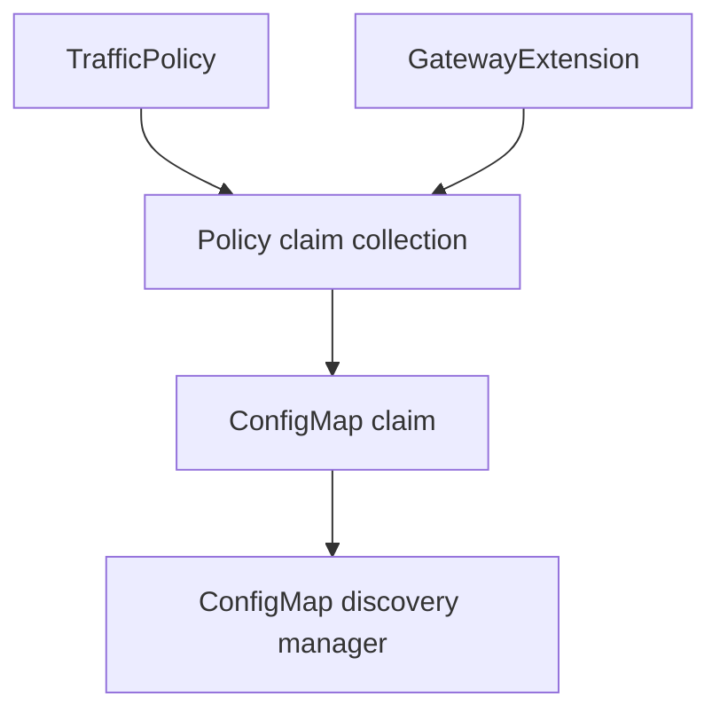
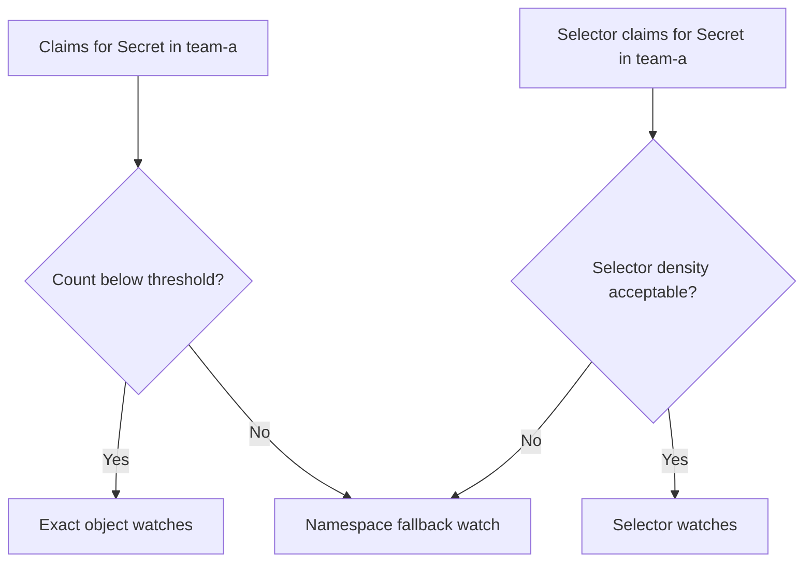

# EP-13786: Resource Discovery Scoping

* Issue: [#13786](https://github.com/kgateway-dev/kgateway/issues/13786)

## Background

Today kgateway scopes namespaced discovery with a single outer boundary: `discoveryNamespaceSelectors`.
That setting is parsed from `api/settings/settings.go`, turned into a dynamic namespace filter in
`pkg/pluginsdk/collections/discovery.go`, and then applied broadly to namespaced collections in
`pkg/pluginsdk/collections/collections.go` and `pkg/pluginsdk/collections/setup.go`.

This is the right model for primary routing resources such as `Gateway`, `HTTPRoute`, `GRPCRoute`,
`Service`, `Backend`, `GatewayExtension`, and policy CRDs. Operators usually want those resources to be
discoverable from many workload namespaces.

The same model is too expensive for high-cardinality secondary resources such as `Secret` and `ConfigMap`.
Once a namespace is inside the discovery boundary, kgateway currently caches nearly every object of those
types in that namespace, even though most are never referenced by gateway configuration.

The issue report includes a production heap profile where `Secret` and `ConfigMap` objects dominate control
plane memory. Reviewers should use the linked issue as the source of the concrete memory data and heap
profiling context. That is the problem this EP addresses.

This proposal intentionally takes a different direction than label-driven opt-in discovery. Rather than
asking operators to label resources that kgateway should discover, this design treats most `Secret` and
`ConfigMap` objects as **derived dependencies** and discovers them from the references already present in
Gateways, Routes, policies, backends, and extensions.

## Motivation

The strongest argument for reference-driven discovery is that gateway-relevant `Secret` and `ConfigMap`
objects are usually not independent resources. They are inputs to already-discovered objects:

- a listener references a TLS secret
- a backend policy references TLS material
- a traffic policy references a secret, a selector, or a gateway extension
- a gateway extension references a JWT key `ConfigMap`

If kgateway can compute that dependency graph directly, it can reduce memory without asking operators to
annotate individual resources and without widening discovery beyond what the configuration already needs.

### Goals

- Reduce memory consumed by cached `Secret` and `ConfigMap` objects
- Preserve broad discovery for primary routing resources
- Discover secondary resources automatically from existing references instead of requiring resource labels
- Support direct references, selector-based references, and transitive references through intermediate
  objects such as `GatewayExtension`
- Fit the KRT architecture so claim recalculation follows normal dependency tracking
- Keep current translation and `ReferenceGrant` semantics intact
- Preserve backward compatibility by default

### Non-Goals

- Replacing `discoveryNamespaceSelectors`
- Changing route, listener, backend, or xDS translation semantics
- Changing `ReferenceGrant` authorization rules
- Providing exact-reference discovery for every possible future plugin without plugin participation
- Eliminating all fallbacks to broader discovery in pathological or opaque cases
- Solving cluster-scoped resource discovery

## Implementation Details

### Proposed Model

The model splits watched resources into two groups:

1. **Primary resources**: broadly watched inside `discoveryNamespaceSelectors`
2. **Derived resources**: watched only when claimed by primary resources or by objects that were derived from
   them

For the first version, the main derived resource types are:

- core `Secret`
- core `ConfigMap`

Primary resources remain broadly watched because they define intent and topology:

- namespaces
- Gateways and route types
- Services and backend CRDs
- `ReferenceGrant`
- policy CRDs
- `GatewayExtension`

Derived resources are discovered through a graph of **discovery claims**.

### Discovery Claims

Introduce a new internal model:

```go
type DiscoveryClaim struct {
    Resource schema.GroupKind
    Namespace string

    Exact    *types.NamespacedName
    Selector *metav1.LabelSelector

    // Why this claim exists. Used for dedupe, debugging, and metrics.
    Owner ir.ObjectSource
}
```

A claim means: "kgateway currently depends on this resource or set of resources."

The first version supports two claim shapes:

- **Exact claim** -> a single namespaced object by name
- **Selector claim** -> all objects of a type in a namespace matching a selector

Examples:

- listener TLS certificate -> exact `Secret` claim
- JWT local JWKS -> exact `ConfigMap` claim
- API key auth `secretSelector` -> selector `Secret` claim

### How Claims Are Produced

Claims are produced close to the code that already understands each reference shape.

#### Core Claim Producers

Core code emits claims for references found in:

- Gateway listener TLS configuration
- backend TLS configuration
- any other core translator path that directly references `Secret` or `ConfigMap`

This keeps claim logic near the existing source-of-truth code paths such as
`pkg/kgateway/translator/listener/gateway_listener_translator.go`,
`pkg/kgateway/translator/sslutils/ssl_utils.go`, and backend-related policy handling.

#### Plugin Claim Producers

Plugins must explicitly contribute claims for any secondary resources they need.

Add a first-class plugin hook in the plugin SDK:

```go
type PolicyPlugin struct {
    Policies krt.Collection[ir.PolicyWrapper]
    DiscoveryClaims krt.Collection[DiscoveryClaim]
    // ...
}

type BackendPlugin struct {
    Backends krt.Collection[ir.BackendObjectIR]
    DiscoveryClaims krt.Collection[DiscoveryClaim]
    // ...
}
```

This is the recommended phase-1 decision and should not remain unresolved during implementation. It is the
key design choice that makes reference-driven discovery practical. Instead of trying to
introspect arbitrary plugin logic, kgateway asks plugins to declare the secondary resources they depend on.

That directly addresses one of the main downsides of this approach: extensibility.

### Transitive Discovery

Some references are indirect:

- `TrafficPolicy` -> `GatewayExtension` -> JWT config -> `ConfigMap`
- route or policy -> backend -> backend auth secret

Reference-driven discovery must therefore compute a transitive closure, not just direct references.

The design handles this by producing claims from KRT collections that already depend on intermediate objects.
For example:

- a `TrafficPolicy` claim collection can depend on both `TrafficPolicy` and `GatewayExtension`
- when the extension changes, the claim collection recomputes automatically
- if the extension starts or stops referencing a `ConfigMap`, the corresponding claim is added or removed

This lets KRT handle the dependency invalidation rather than introducing a separate graph engine outside the
existing runtime model.



### Claim Materialization

Claims do not populate the cache by themselves. They are consumed by a new component in the collections
layer: the **derived resource discovery manager**.

Responsibilities:

- union and dedupe claims from all core and plugin producers
- create narrow watches or point lookups for claimed resources
- publish merged `Secret` and `ConfigMap` collections to existing indices
- tear down unused watches when claims disappear

### Materialization Strategy

This is where the major downsides of reference-driven discovery must be handled carefully.

Kubernetes does not provide a native "watch this arbitrary set of names" API. A naive implementation would
either:

- open one watch per object, which can overwhelm the API server
- or fall back to watching the full namespace, which gives back much of the unwanted memory usage

This EP proposes an adaptive strategy with three modes.

#### Mode 1: Exact Object Watch

For a small number of exact claims in a namespace, create one narrow client per object using a
`metadata.name=<object-name>` field selector. This is intentionally one watch per claimed name, not one watch for an
arbitrary name set, because Kubernetes field selectors support equality on `metadata.name` but do not support
an OR-style watch over many specific object names in a single request.

Use when:

- the resource is claimed by exact name
- claim count for that `(GroupKind, Namespace)` stays below a threshold

Pros:

- best memory profile
- immediate updates when the object changes

Cons:

- many watch streams if claim count grows

#### Mode 2: Selector Watch

For selector claims, create a namespaced watch with the selector pushed to the API server.

Use when:

- the claim is selector-based, such as `TrafficPolicy` API key auth selecting secrets by label

Pros:

- selector semantics stay correct as matching objects are created, updated, or deleted
- efficient when selectors are selective

Cons:

- duplicate selectors can create redundant watches unless normalized and deduped
- less predictable than exact claims

#### Mode 3: Namespace Fallback Watch

When exact or selector claims in a namespace become too numerous, or when a plugin cannot precisely express
its dependency set, escalate to a broader namespaced watch for that resource type and filter in memory.

Use when:

- exact watch count crosses a configurable threshold
- too many selector watches would be more expensive than one namespace watch
- a plugin or well-known subsystem explicitly requests fallback

Pros:

- bounds watch-stream explosion
- preserves correctness in high-density namespaces

Cons:

- weaker memory savings in that namespace

This is an intentional safety valve. Reference-driven discovery is attractive because it can be much tighter
than namespace-wide informer scoping, but the system must remain operational even when references become dense
or highly dynamic.

### Adaptive Escalation

The discovery manager maintains per `(GroupKind, Namespace)` state:

- exact claim count
- unique selector count
- whether the namespace is already in fallback mode

Once a threshold is crossed, the manager promotes that namespace and resource type to fallback mode and
reuses one shared watch.

Example:



This is the primary mitigation for API-server pressure.

### Missing Resources and Eventual Consistency

Claims must persist even when the target object does not currently exist.

Example:

- a route references a secret
- the secret has not been created yet
- kgateway should remain aware of that dependency and react when the secret appears later

Therefore:

- missing exact claims still create a tracked dependency entry
- the discovery manager retries lookup and maintains a watch or resync path
- removing the parent reference removes the tracked dependency

To avoid flapping:

- claim removal should use a short grace period before tearing down watches
- missing resources should be rechecked with backoff
- a periodic full recomputation should exist as a correctness safety net

This directly addresses another major downside of the approach: race conditions between reference updates and
resource creation.

### Authorization and ReferenceGrant

Discovery and authorization remain separate concerns.

Rules:

- same-namespace references can always produce claims
- cross-namespace references can produce claims once the source object, target reference, and any required
  `ReferenceGrant` allow the dependency
- if a `ReferenceGrant` is added later, the claim producer recomputes and activates the claim

This preserves current read-time semantics in `SecretIndex` and `ConfigMapIndex` while avoiding premature
caching of cross-namespace objects that are not actually authorized.

### Well-Known and Opaque Dependencies

Some dependencies are not naturally expressed by user-facing references.

Example:

- the OAuth2 HMAC secret exposed as `wellknown.OAuth2HMACSecret` in
  `pkg/kgateway/wellknown/constants.go`

The design therefore supports **static seed claims** registered by kgateway itself.

This is also the escape hatch for opaque subsystems where an exact dependency set cannot be computed from
references alone.

Static seed claims should be used sparingly, but they are necessary to keep the system robust.

### Configuration

The feature should be introduced behind an explicit mode switch. Default behavior remains unchanged.

Suggested settings:

```yaml
resourceDiscovery:
  mode: legacy
  derivedResourceTypes:
    - group: ""
      kind: Secret
    - group: ""
      kind: ConfigMap
  maxExactWatchesPerNamespace: 32
  maxSelectorWatchesPerNamespace: 16
  staticSeedNamespaces:
    - kgateway-system
```

Modes:

- `legacy` -> current namespace-scoped informer behavior
- `referenced` -> use claim-driven discovery for configured derived resource types

Purpose of the extra knobs:

- `derivedResourceTypes` limits rollout scope
- `maxExactWatchesPerNamespace` bounds API-server pressure
- `maxSelectorWatchesPerNamespace` bounds selector-watch explosion
- `staticSeedNamespaces` provides a conservative operational safety net

This makes rollout safer and explicitly acknowledges the downsides of the design rather than pretending they do
not exist.

The values `32` and `16` are initial starting points, not asserted optimums. They are intentionally
conservative budgets: large enough to keep sparse namespaces on narrow watches, but low enough that a
high-density namespace promotes before the controller opens an excessive number of watch streams. They should
still be tuned using scale and API server load testing before referenced mode is enabled beyond experimental
rollout.

### Deployer

The Helm chart needs updates for the new settings in:

- `install/helm/kgateway/values.yaml`
- `install/helm/kgateway/templates/deployment.yaml`

No RBAC changes are expected because kgateway already has `get`, `list`, and `watch` access for the relevant
resource types and namespaces.

### Translator and Existing Interfaces

The translator should keep using the same high-level interfaces:

- `SecretIndex`
- `ConfigMapIndex`
- query helpers such as `GetSecretForRef()` and `GetConfigMapForRef()`

The change is in how those collections are populated, not how translation consumes them.

That keeps the rest of the system stable and limits blast radius.

### Plugin Rollout Strategy

Reference-driven discovery will fail if plugins keep resolving secrets or configmaps without emitting claims.

So rollout should be staged:

1. add claim plumbing and keep `legacy` mode as default
2. implement core claim producers
3. implement claim producers for built-in plugins that reference `Secret` or `ConfigMap`
4. add test coverage that any built-in plugin using `SecretIndex` or `ConfigMapIndex` in referenced mode also
   contributes claims

This is the other major mitigation for extensibility risk.

### Observability

This feature needs strong observability because failures will often look like "resource unexpectedly not
discovered."

Required signals:

- metric for active exact claims by resource type
- metric for active selector claims by resource type
- metric for namespaces promoted to fallback mode
- metric for missing claimed objects
- metric for claims suppressed due to missing `ReferenceGrant`
- debug endpoint or log dump showing why a particular object is currently claimed

Recommended logs:

- when a namespace is promoted to fallback mode
- when a plugin in referenced mode resolves a secondary resource without a corresponding claim
- when claim churn crosses a warning threshold

### Backward Compatibility

Backward compatibility is preserved by default because the feature ships behind `resourceDiscovery.mode=legacy`.

When `referenced` mode is enabled:

- primary-resource discovery remains bounded by `discoveryNamespaceSelectors`
- translation semantics remain the same
- memory behavior changes only for configured derived resource types

The biggest compatibility risk is incomplete claim coverage. That is why the mode should remain opt-in until
built-in plugins and core paths are proven complete.

### Example Walkthrough

Assume:

- `HTTPRoute` and `TrafficPolicy` in namespace `team-a` are inside `discoveryNamespaceSelectors`
- the route terminates TLS with `team-a/app-cert`
- the traffic policy references `GatewayExtension team-a/jwt-ext`
- that extension references `ConfigMap team-a/jwt-keys`

Flow:

1. kgateway broadly watches the route, policy, and extension
2. claim producers emit:
   - exact `Secret team-a/app-cert`
   - exact `ConfigMap team-a/jwt-keys`
3. the discovery manager materializes narrow discovery for those objects
4. `SecretIndex` and `ConfigMapIndex` expose them to translation
5. if `jwt-keys` is deleted, the narrow watch signals the change and translation recomputes

No labels are required on the secondary resources.

### Test Plan

#### Unit Tests

- claim generation for direct secret and configmap references
- claim generation for selector-based references
- transitive claim generation through `GatewayExtension`
- claim dedupe across multiple owners
- exact-watch to namespace-fallback promotion logic
- missing-resource retry and grace-period teardown logic
- claim activation and deactivation when `ReferenceGrant` changes

#### Collection and Integration Tests

- referenced mode populates `SecretIndex` and `ConfigMapIndex` only with claimed resources
- selector claims react correctly when matching objects are created or relabeled
- namespace fallback mode preserves correctness after threshold promotion
- static seed claims keep well-known control-plane resources available

#### Plugin Tests

- built-in plugins that consume `SecretIndex` or `ConfigMapIndex` also produce claims
- referenced mode catches accidental omissions in built-in plugin coverage

#### Translator Tests

Reuse existing multi-namespace translator scenarios and add cases where:

- a referenced secret is absent and later appears
- a gateway extension changes its transitive configmap dependency
- cross-namespace references become active only after `ReferenceGrant` is added

#### End-to-End Tests

- enable referenced mode for `Secret` and `ConfigMap`
- verify that unlabeled but referenced resources are discovered automatically
- verify that unrelated secrets and configmaps in the same namespace are not cached in exact-watch mode
- verify fallback promotion behavior in a namespace with many claims

## Alternatives

### Label-Driven Opt-In Discovery

Use a global mode plus namespace overrides and a `kgateway.dev/discovery` label on individual resources.

Pros:

- conceptually simpler
- easy to push most filtering to the API server
- generic across plugins because it does not need plugin participation

Cons:

- requires operators to label referenced resources correctly
- shifts correctness burden from configuration authors to cluster operators
- still watches resources based on labels rather than true dependency structure

This EP intentionally prefers reference-driven discovery because it aligns better with the actual ownership
model of gateway dependencies.

### Keep Namespace-Only Filtering

Continue relying only on `discoveryNamespaceSelectors`.

Pros:

- no new complexity

Cons:

- does not address the memory problem

## Open Questions

- Do we support selector claims in the first release, or start with exact-name claims and keep selector-based
  features on legacy discovery until the selector path is proven?
- What should the exact escalation thresholds be before switching from exact or selector watches to namespace
  fallback mode?
- Do we need a dedicated admin debug view for "why is this object claimed?" before enabling referenced mode
  by default?
