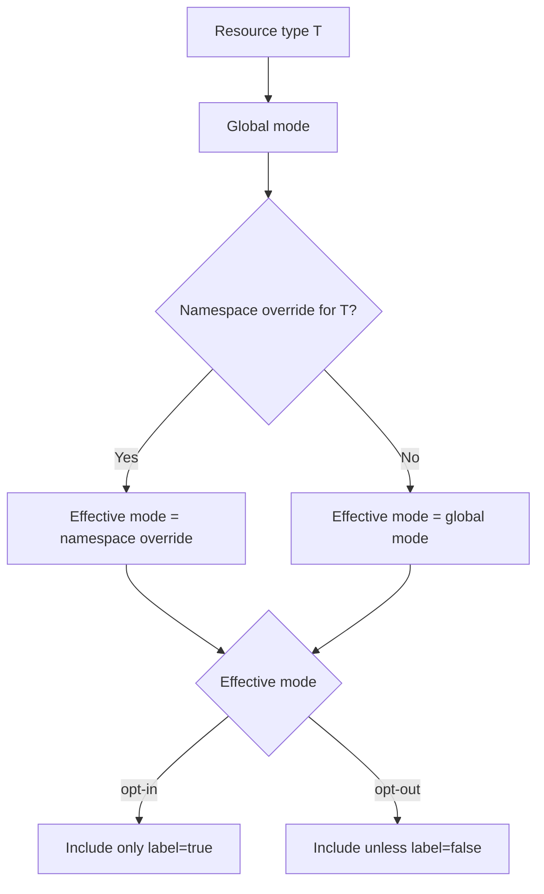
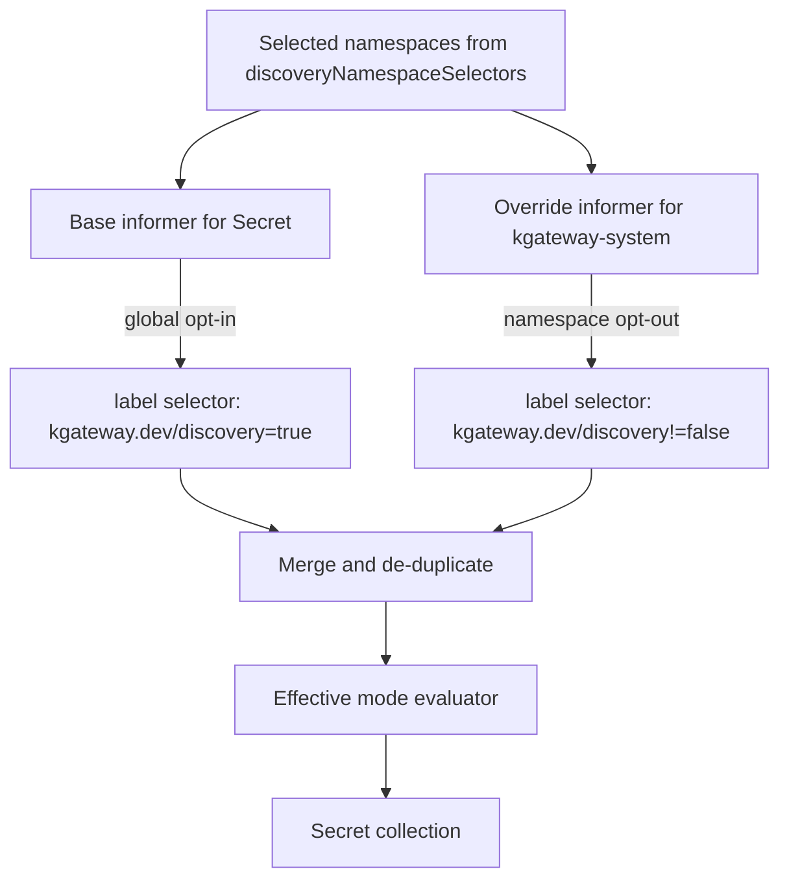

# EP-13786: Resource Discovery Scoping

* Issue: [#13786](https://github.com/kgateway-dev/kgateway/issues/13786)

## Background

Today kgateway has a single discovery boundary for namespaced resources: `discoveryNamespaceSelectors`.
That setting is parsed from `api/settings/settings.go`, converted into a dynamic namespace filter in
`pkg/pluginsdk/collections/discovery.go`, and then applied uniformly to namespaced collections created in
`pkg/pluginsdk/collections/collections.go` and `pkg/pluginsdk/collections/setup.go`.

This model works well for route and backend discovery because operators usually want kgateway to discover
`Gateway`, `HTTPRoute`, `GRPCRoute`, `Service`, and related policy resources from many workload namespaces.
The same model is much less efficient for high-cardinality resources such as `Secret` and `ConfigMap`.
In large clusters, kgateway ends up caching nearly every object of those types from every discovered
namespace, even though only a small subset is ever referenced by gateway configuration.

The result is avoidable memory pressure in the control plane. The issue report includes a production heap
profile where `Secret` and `ConfigMap` objects account for most of the process heap.

## Motivation

Operators need a way to keep broad discovery for routing resources while tightening discovery for resource
types that are expensive to cache and usually referenced explicitly.

The solution must preserve the current mental model that `discoveryNamespaceSelectors` defines the outer
namespace boundary, and then add a second layer that controls how individual resource types are discovered
inside that boundary.

### Goals

- Reduce memory consumed by cached high-cardinality resources such as `Secret` and `ConfigMap`
- Preserve current behavior for all existing installations by default
- Provide a generic mechanism that applies to any namespaced resource type kgateway watches
- Allow namespace-level overrides for control-plane or shared infrastructure namespaces
- Allow resource-level inclusion or exclusion using a single well-known label
- Push filtering to the API server when possible so memory savings come from smaller informer caches, not
  only from dropping objects after they are received
- Fit within the existing KRT and plugin-based collection architecture without changing translation semantics

### Non-Goals

- Replacing `discoveryNamespaceSelectors`
- Changing how `ReferenceGrant` authorization works for cross-namespace references
- Changing translator behavior for routes, policies, or xDS generation
- Filtering cluster-scoped resources
- Inferring all discoverable `Secret` and `ConfigMap` references on demand instead of watching them
- Introducing resource-type-specific booleans such as `watchAllSecrets` or `watchAllConfigMaps`

## Implementation Details

### Proposed Model

The design adds a second discovery layer beneath `discoveryNamespaceSelectors`.

1. `discoveryNamespaceSelectors` remains the outer namespace boundary.
2. A new per-resource-type default decides whether a type is globally `opt-in` or `opt-out`.
3. Namespace annotations can override the global mode for a specific resource type.
4. A single resource label is interpreted according to the resolved mode.

The result is:

- Route and backend resource types continue to use the current `opt-out` behavior by default
- Expensive resource types such as `Secret` and `ConfigMap` can be switched to `opt-in`
- Operators can still force full discovery in selected namespaces such as `kgateway-system`

### Configuration

Add a new settings field and Helm value:

```yaml
discoveryResourceDefaults:
  - group: ""
    kind: Secret
    mode: opt-in
  - group: ""
    kind: ConfigMap
    mode: opt-in
```

The setting is represented internally as a list keyed by `GroupKind`:

- `group`: Kubernetes API group, empty string for core resources
- `kind`: resource kind
- `mode`: one of `opt-in` or `opt-out`

Resources that are not listed default to `opt-out`, which preserves current behavior.

The controller exposes the setting through a new environment variable:

```text
KGW_DISCOVERY_RESOURCE_DEFAULTS
```

Its wire format should follow the existing pattern used for `KGW_DISCOVERY_NAMESPACE_SELECTORS`: Helm renders
YAML, the Deployment injects JSON, and `api/settings/settings.go` parses the JSON into a typed structure.

### Resource Label

Add a single resource label:

```text
kgateway.dev/discovery
```

Supported values:

- `"true"` -> explicitly include the resource
- `"false"` -> explicitly exclude the resource

Label interpretation depends on the resolved mode:

- `opt-in`: only resources labeled `"true"` are included
- `opt-out`: all resources are included unless labeled `"false"`

For `opt-out` mode, kgateway should use an API-server label selector equivalent to:

```text
kgateway.dev/discovery!=false
```

For `opt-in` mode, kgateway should use:

```text
kgateway.dev/discovery=true
```

This allows API-server-side filtering for both modes.

### Namespace Override

Allow a namespace to override the global mode for a resource type.

Recommended key format:

```text
kgateway.dev/discovery.<group>.<kind>
```

Examples:

```text
kgateway.dev/discovery.core.Secret: opt-out
kgateway.dev/discovery.core.ConfigMap: opt-in
kgateway.dev/discovery.gateway.networking.k8s.io.HTTPRoute: opt-in
```

For the core API group, `core` is used as the canonical group token instead of an empty segment.

Invalid values are ignored and produce a warning log. In that case, kgateway falls back to the global default.
Unknown group-kind keys are also ignored.

### Mode Resolution

For a namespaced resource of type `T` in namespace `N`:

1. Start with the global default for `T` from `discoveryResourceDefaults`, or `opt-out` if unset.
2. If namespace `N` has a valid override annotation for `T`, use the namespace value instead.
3. Interpret the `kgateway.dev/discovery` label according to the resolved mode.

This can be modeled as:



### Controller Runtime

#### Resource Discovery Resolver

Introduce a new resolver in the collections layer that combines:

- global defaults from settings
- namespace metadata from the existing unfiltered namespace collection
- annotation parsing and validation

The resolver exposes:

- effective mode lookup for `GroupKind` + namespace
- API-server label selector for a resource type and mode
- callbacks when namespace overrides for a resource type change

This resolver is separate from the current `discoveryNamespacesFilter`, but both are used together:

- namespace filter decides whether a namespace is inside the overall discovery boundary
- resource resolver decides how a resource type is discovered inside that boundary

#### Scoped Informer Strategy

The current model uses one informer per watched resource type, filtered only by namespace. That is not
enough once resource-type behavior can vary by namespace.

For each scoped namespaced resource type, kgateway should create:

1. A base informer using the global mode
2. Zero or more namespace-specific override informers for namespaces whose override differs from the global mode
3. A lightweight in-memory evaluator that enforces the final effective-mode decision before objects enter the
   downstream collection

The base informer is where the main memory reduction happens:

- global `opt-in` -> cluster-wide informer with `kgateway.dev/discovery=true`
- global `opt-out` -> cluster-wide informer with `kgateway.dev/discovery!=false`

Namespace override informers fill the gaps that cannot be expressed with a single cluster-wide watch. The
most important case is a globally `opt-in` resource type with a small number of `opt-out` namespaces, such as
`kgateway-system`.

For example:



This design intentionally optimizes the primary use case from the issue:

- globally `opt-in` for `Secret` and `ConfigMap`
- a small number of opt-out namespaces that must be fully watched

#### Correctness vs. Memory Trade-Off

There is one important trade-off. If a resource type is globally `opt-out` and a namespace overrides it to
`opt-in`, the base informer still fetches unlabeled objects from that namespace. The in-memory evaluator can
drop them from downstream collections, so correctness is preserved, but memory is not reduced for that
namespace.

This is acceptable because:

- the default and recommended memory-saving rollout is global `opt-in` for selected types
- namespace `opt-in` on top of global `opt-out` is expected to be rare
- the design still provides correct behavior for both directions of override

If future usage shows that the reverse pattern matters operationally, kgateway can extend the implementation
to partition watches more aggressively.

### Plugin

The mechanism must be generic across all watched namespaced resources, including plugin-owned collections.

To make that practical, kgateway should add a reusable helper in `pkg/pluginsdk/collections` for creating
resource-scoped informers and collections. Core collections and plugin collections should migrate from direct
`kclient.NewFiltered` calls that only apply `ObjectFilter` to a helper that also registers the resource type
with the resolver.

This keeps the configuration model generic while avoiding resource-type-specific code paths in each plugin.

Initial rollout should cover at least:

- core `Secret` and `ConfigMap` collections
- route and backend collections created in `pkg/pluginsdk/collections/setup.go`
- plugin collections that currently use `commoncol.Client.ObjectFilter()`

Cluster-scoped resources remain unchanged.

### Controllers

No new top-level controller is required. The change lives in the collection and informer setup path.

However, the namespace collection becomes even more important because it now drives:

- namespace membership for discovery
- namespace-level discovery mode overrides
- dynamic creation and teardown of override informers

The implementation should therefore:

- reuse the existing unfiltered namespace collection
- reconcile override informer membership when namespace annotations change
- avoid restarting unaffected informers when unrelated namespace labels or annotations change

### Deployer

The Helm chart needs three updates:

1. Add `discoveryResourceDefaults` to `install/helm/kgateway/values.yaml`
2. Inject `KGW_DISCOVERY_RESOURCE_DEFAULTS` into `install/helm/kgateway/templates/deployment.yaml`
3. Document the new setting next to `discoveryNamespaceSelectors`

No RBAC changes are expected because kgateway already has the required `get`, `list`, and `watch` permissions
for the relevant resource types and already watches namespaces.

### Translator and Proxy Syncer

No translator or xDS protocol changes are required.

Downstream components should continue to consume `Secret`, `ConfigMap`, route, backend, and policy collections
exactly as they do today. The discovery mechanism changes which objects are present in those collections, but
not the collection interfaces themselves.

Reference resolution behavior also remains unchanged:

- same-namespace lookups continue to work if the referenced object is discovered
- cross-namespace access still requires `ReferenceGrant` where applicable

### Reporting

The feature should emit clear operator signals:

- warning log when a namespace annotation has an invalid mode
- warning log when a namespace annotation references an unknown or unsupported resource type
- info or debug log when override informers are created or removed

It should also expose metrics so operators can understand whether discovery scoping is behaving as intended.
Suggested metrics:

- number of configured resource-type defaults
- number of active override informers by resource type
- number of namespaces with valid overrides
- number of invalid override annotations seen

The first version can start with logs and a minimal invalid-annotation counter if adding the full metric set is
too much scope.

### Example Rollout

```yaml
discoveryNamespaceSelectors:
  - matchLabels:
      kgateway: discovered

discoveryResourceDefaults:
  - group: ""
    kind: Secret
    mode: opt-in
  - group: ""
    kind: ConfigMap
    mode: opt-in
```

```yaml
apiVersion: v1
kind: Namespace
metadata:
  name: kgateway-system
  annotations:
    kgateway.dev/discovery.core.Secret: opt-out
    kgateway.dev/discovery.core.ConfigMap: opt-out
```

```yaml
apiVersion: v1
kind: Secret
metadata:
  name: app-cert
  namespace: team-a
  labels:
    kgateway.dev/discovery: "true"
```

Outcome:

- all selected namespaces still contribute routes, services, and policies by default
- `kgateway-system` still contributes all `Secret` and `ConfigMap` objects
- workload namespaces only contribute explicitly labeled `Secret` and `ConfigMap` objects

### Backwards Compatibility

Backwards compatibility is preserved by default:

- `discoveryNamespaceSelectors` keeps its current meaning
- unconfigured `discoveryResourceDefaults` means all types are `opt-out`
- unlabeled resources remain discoverable unless their type is explicitly switched to `opt-in`

This means upgrading kgateway without changing values produces the same behavior as today.

### Test Plan

#### Unit Tests

- settings parsing for `discoveryResourceDefaults`
- validation of duplicate or malformed `GroupKind` entries
- namespace annotation parsing and fallback behavior
- effective mode resolution for all combinations of global mode, namespace override, and resource label
- informer reconciliation logic when namespace labels or annotations change
- merge and de-duplication behavior when base and override informers see the same object

#### Integration and Collection Tests

- `Secret` and `ConfigMap` collection tests showing API-server label selector selection for `opt-in` and
  `opt-out`
- dynamic namespace update tests showing override informer creation and teardown
- plugin collection tests confirming the helper works for plugin-owned informers

#### Translator Tests

Reuse the existing multi-namespace discovery translator coverage and add scenarios where:

- a referenced `Secret` is absent because it is not labeled in `opt-in` mode
- the same `Secret` becomes discoverable after the label is added
- a control-plane namespace override keeps control-plane `Secret` and `ConfigMap` discovery unchanged

#### End-to-End Tests

Add an e2e scenario that:

1. deploys kgateway with `Secret` and `ConfigMap` set to global `opt-in`
2. verifies that a route depending on an unlabeled workload `Secret` or `ConfigMap` is unresolved
3. labels the object and verifies the route becomes accepted
4. verifies that unlabeled control-plane resources in the override namespace continue to work

## Alternatives

### Infer Discoverable Resources from References

Instead of watching `Secret` and `ConfigMap` broadly, kgateway could attempt to compute the exact referenced
objects from `Gateway`, `HTTPRoute`, and policy resources and then fetch only those objects.

Pros:

- potentially the lowest steady-state memory footprint
- avoids asking operators to label referenced objects

Cons:

- much more complex than informer scoping
- hard to make generic across plugins and future resource types
- many references are indirect, selector-based, or introduced by plugins
- risks race conditions and degraded responsiveness if the controller must continually materialize ad hoc
  watches or point reads

This is a reasonable long-term direction to revisit, but it should not block a simpler and more general
solution now.

### Resource-Type-Specific Booleans

Add flags such as `watchSecretsOptIn` and `watchConfigMapsOptIn`.

Pros:

- simple UX for the first use case

Cons:

- does not scale to all watched resource types
- adds a one-off knob every time memory pressure appears for another resource type
- pushes complexity into product configuration rather than the discovery system

This does not satisfy the generic-mechanism requirement.

### Namespace-Only Filtering

Keep the current namespace filter and ask operators to move all gateway-referenced `Secret` and `ConfigMap`
objects into a small set of shared namespaces.

Pros:

- no controller changes required

Cons:

- not workable in many multi-tenant clusters
- forces application and platform teams to reorganize resources around controller limitations
- does not solve the need to discover routes and services broadly while scoping secrets narrowly

## Open Questions

- Should namespace override keys use the proposed `group.kind` format, or should they include version for
  readability even though the implementation resolves by `GroupKind`?
- How much of the plugin surface should migrate in the first release versus a follow-up cleanup?
- Do we want a user-facing status condition or only logs and metrics when a referenced resource is filtered
  out by discovery scoping?
